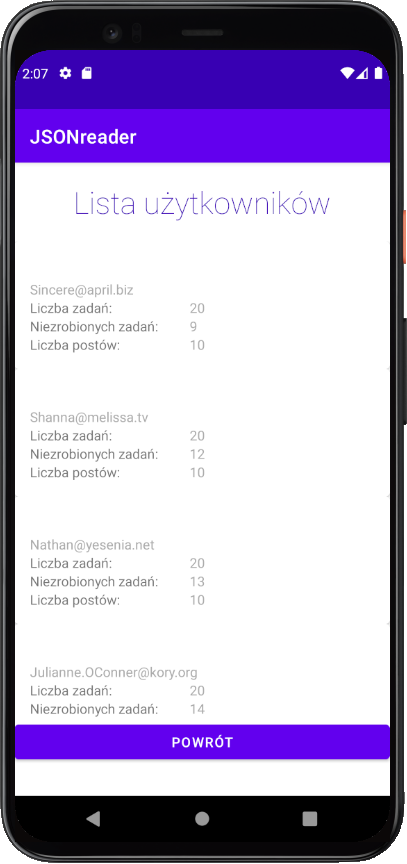
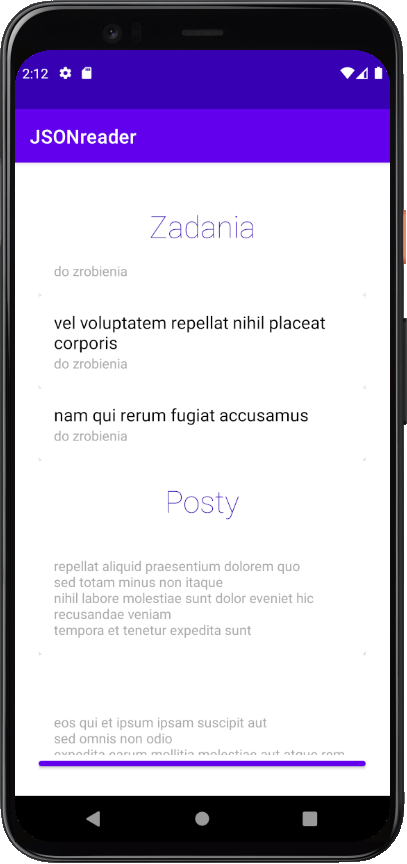
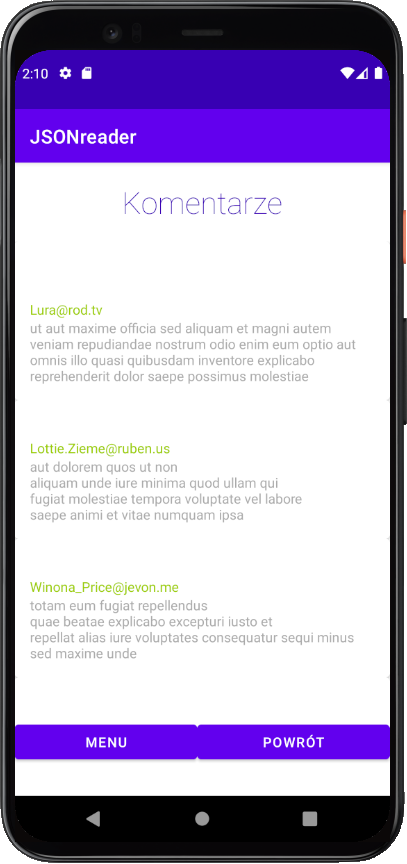

# Json Reader

## Table of contents
* [Screenshots](#screenshots)
* [Technologies](#technologies)
* [Features](#features)

## Screenshots

## Technologies
* Kotlin

## Features
* Fetches jsons from [jsonplaceholder API](https://jsonplaceholder.typicode.com)
* You can view users data, number of their TODO tasks and number of their posts.

* When you click on user, you can see list of his tasks and see if they're done or not. You can also see all his posts.

* When you click post you can see all comments related to given post.

